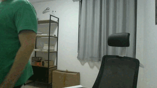
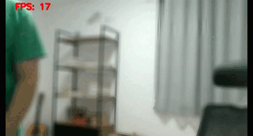

# WebCam Effects

Original             |  Processed
:-------------------------:|:-------------------------:
  |  

## Requirements

Go through the following steps to get your environment up and running.
### Installing

To install the WebCam Effects module run the following command:

```bash
pip install -e .
```

obs: It has only been tested on python 3.7 but it is likely to work on other versions.

### Setup Virtual Video Device

To create the virtual video device run the following command:

```bash
sudo modprobe v4l2loopback exclusive_caps=1 video_nr=2 # creates /dev/video2
```
obs: It may require you to install v4l2loopback module (`sudo apt install v4l2loopback-dkms`)

### Running

During the installation of the WebCam Effects it will create an entrypoint called 'wce' which you can use to run it. So, just put it in your console and press enter:

```bash
wce
```

You can change the effects in real time by updating the `config.yaml` file.

### Available Effects

| Name | Description | Arguments |
| ------ | ----------- | ---------- |
| `BG_BLUR` | Blur the image background | (`kernel_size`: int, `dilate`: int) |
| `BG_REMOVE` | Remove the background | (`kernel_size`: int,  `dilate`: int) |
| `FACE_FOLLOW` | Follow the face | (`scale`: float,  `filter`: float) |
| `FLIP` | Flip the image | (`horizontal`: bool, `vertical`: bool) |
| `BRIGHTNESS_AND_CONTRAST` | Enhance the image brightness and contrast | (`alpha`: float, `beta`: int) |
| `BILATERAL_FILTER` | OpenCV Bilateral filter | (`kernel_size`: int) |
| `FPS` | Show the FPS | (`flip`: bool, `scale`: float, `color`: list) |

___
**Have fun!** :smiley:
